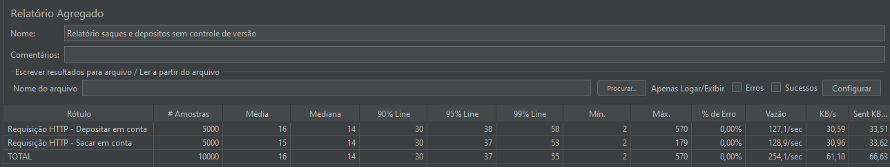
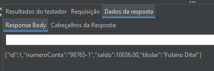
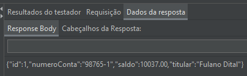
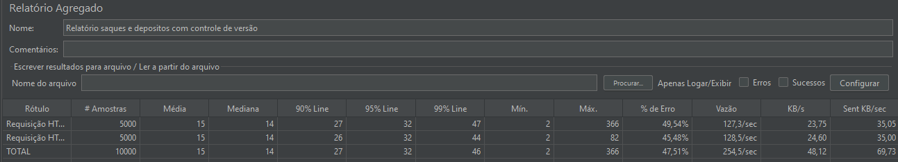
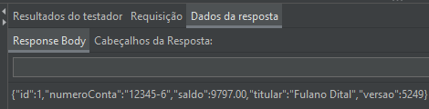
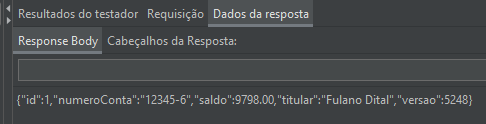

# ConcorrenciaBD - Projeto Spring Boot
**Criado para fins acadêmicos**

Projeto acadêmico que demonstra conceitos de concorrência em aplicações web com banco de dados, utilizando Spring Boot e H2.

## Pré-requisitos

Este projeto utiliza:

- **Java 17** 
- **Maven 3.6+**
- **Spring 3.5.14**
- **Banco h2**

## Estrutura do Projeto

```
ConcorrenciaBD/
├── src/
│   ├── main/
│   │   ├── java/com/faculdade/ConcorrenciaBD/
│   │   │   ├── ConcorrenciaBdApplication.java    # Main da aplicação
│   │   │   ├── entidade/                         # Entidades (JPA)
│   │   │   ├── repository/                       # Repositórios Spring Data JPA
│   │   │   ├── rest/                             # Endpoints REST
│   │   │   └── service/                          # regras de negócio
│   │   └── resources/
│   │       ├── application.properties            # Configurações da aplicação
│   │       ├── schema.sql                        # Criação de tabelas do BD
│   │       └── data.sql                          # Dados iniciais para teste
├── jmeter/                                       # Cenários de teste de carga
```

## Como Executar o Projeto

#### Passo 1: Certifique que o projeto compila com sucesso em sua máquina
```bash
cd ~/ConcorrenciaBD
mvn clean install -U
```

#### Passo 2: 
No VsCode 
1. Instale a extensão **Extension Pack for Java**
2. Abra o projeto em VS Code
3. Clique em `Run` acima da classe `ConcorrenciaBdApplication.java`

#### opção alternativa
Execute a aplicação com: 
```bash
mvn spring-boot:run
```

## Acessar a Aplicação

Após iniciar, a aplicação estará disponível em:

| Recurso | URL |
|---------|-----|
| **API Base** | `http://localhost:8080/concorrencia-bd` |
| **Swagger UI** | `http://localhost:8080/concorrencia-bd/swagger-ui.html` |
| **API Docs (JSON)** | `http://localhost:8080/concorrencia-bd/api-docs` |
| **H2 Console** | `http://localhost:8080/concorrencia-bd/h2-console` |

### Acessar Console H2

O console do banco de dados H2 permite visualizar e manipular os dados:

1. Acesse: `http://localhost:8080/concorrencia-bd/h2-console`
2. Deixe os dados padrão:
   - **Driver Class**: `org.h2.Driver`
   - **JDBC URL**: `jdbc:h2:mem:testdb`
   - **User Name**: `sa`
   - **Password**: *(deixe em branco)*
3. Clique em **Connect**

## Dependências Principais

| Dependência | Versão | Uso |
|------------|--------|-----|
| Spring Boot | 3.5.14 | Framework web |
| Spring Data JPA | Latest | Persistência |
| H2 Database | Latest | BD em memória |
| Lombok | Latest | Reduzir boilerplate |
| SpringDoc OpenAPI | 2.8.13 | Documentação API (Swagger) |
| Spring DevTools | Latest | Hot reload |


##  Referências

- [Spring Boot Docs](https://spring.io/projects/spring-boot)
- [Spring Data JPA](https://spring.io/projects/spring-data-jpa)
- [H2 Database](https://www.h2database.com/)
- [SpringDoc OpenAPI](https://springdoc.org/)

---
## Relatório de conclusão
No teste de carga **sem** controle de versão foram realizadas um total de 10000 requisições, 5000 requisições para o endpoint de saque e 5000 para o endpoint de deposito, cada uma requisição altera em 1 unidade o saldo da conta com um saldo inicial de 10.000, portanto se espera que ao final das requisições o saldo da conta fique inalterado


Ao final das requisições o saldo final foi de 10.037 com 0% da requisições retornando erro, um número superior ao esperado que releva inconsistencia e falta de integridade no valor esperado devido ao alto número de acessos paralelos

 

No teste de carga **com** controle de versão foram realizadas um total de 10000 requisições, 5000 requisições para o endpoint de saque e 5000 para o endpoint de deposito, cada uma requisição altera em 1 unidade o saldo da conta com um saldo inicial de 10.000, portanto se espera que ao final das requisições o saldo da conta fique inalterado


Ao final das requisições o saldo final foi de 9.798 com 47,51% das requisições retornando erro, devido ao fato do controle de versionamento não persistir as alterações ao perceber que outra requisição esta acessando o dado
 